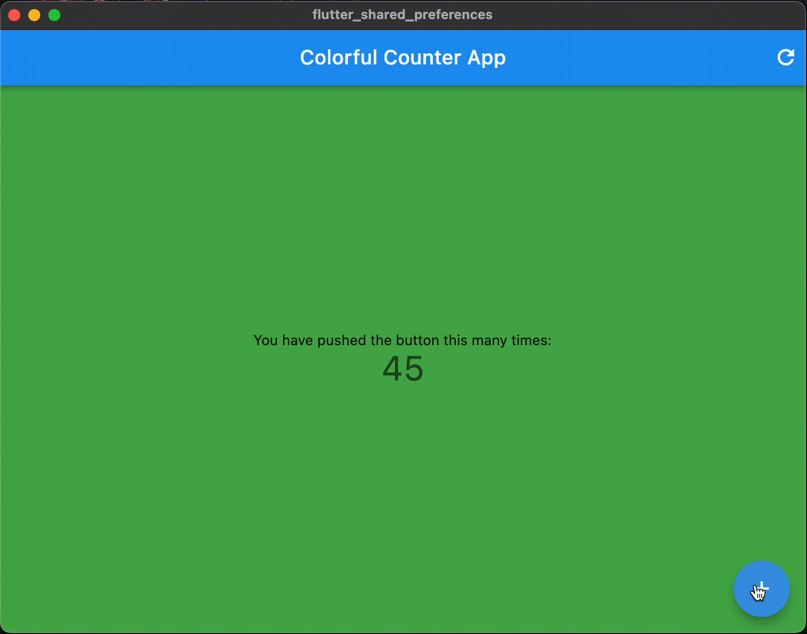

# flutter_shared_preferences

A Colorful Counter App using showing the use of Shared Preferences in Flutter.

We are using the [shared_preferences](https://pub.dev/packages/shared_preferences) package to store the counter value and color value.

The background color of the app is changed based on the color value stored in the shared preferences.

Please refer to the [Medium Article](https://medium.com/@sagarshirbhate_41935/flutter-shared-preferences-2c2e2e2e2e2e) for more details.

# Project Structure

```
lib
-- main.dart
-- services
---- shared_preferences.dart
-- app
---- locator.dart

```

# App Preview


